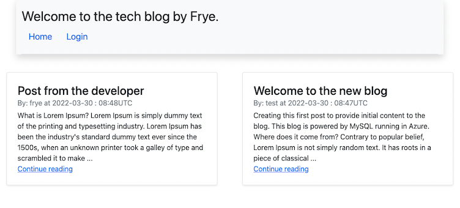

# CMS style blog

## Description
This project implements a basic blogging engine. Data is stored in MySql database. Users can sign up, log in and out, post blog entries and comments when signed in and read posts / comments while signed out.

## License
[](https://opensource.org/licenses/MIT)

## Table of contents
- [Description](#description)
- [License](#license)
- [Installation](#installation)
- [How to use](#how-to-use)
- [More information](#more-information)

## Installation
- Clone the repo
- run ```npm i```
- Create the database (you can use the db/schema.sql for that)
- run the server with ```node server.js```

## How to use


By default the server runs on port 3001 on you local host and you can connect to at [localhost:3001](https://localhost:3001). There is no seed data, so you will need to start by clicking the login button. And from there choosing the sign up link. After creating account successfully, you will be automatically logged in and you can create your first blog post. 

The home page and dashboard show short previews of the blog posts to save screen space. You can expand the post by either clicking the view more or the edit links. When viewing a blog post you can add a comment to it if you are logged in.

## More information:
- Through GitHub: [@frye](https://github.com/frye)
- Via Email: psjcode@gmail.com